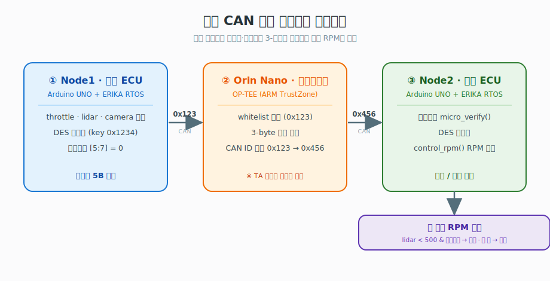
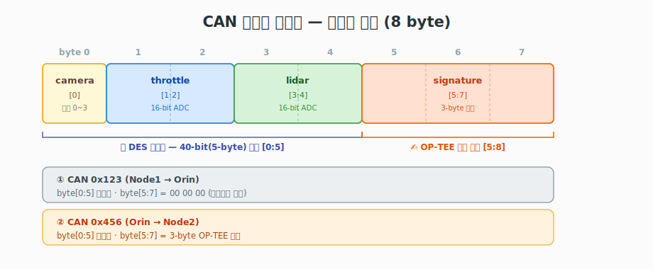
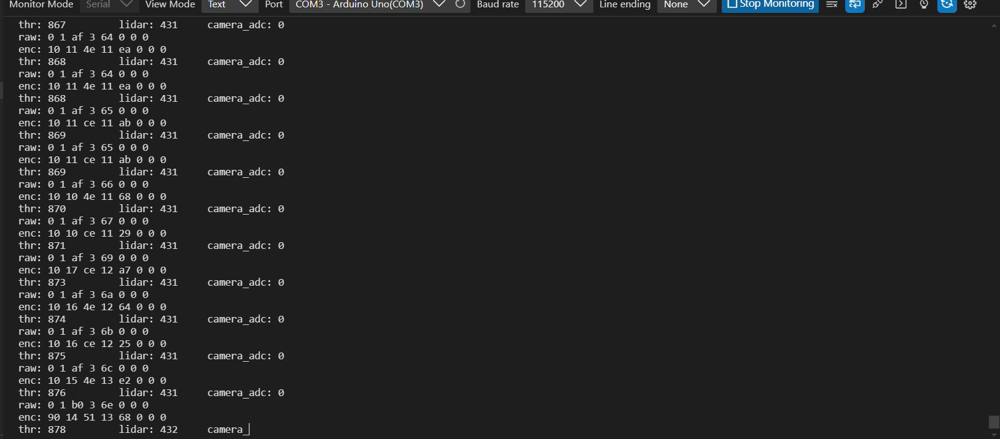
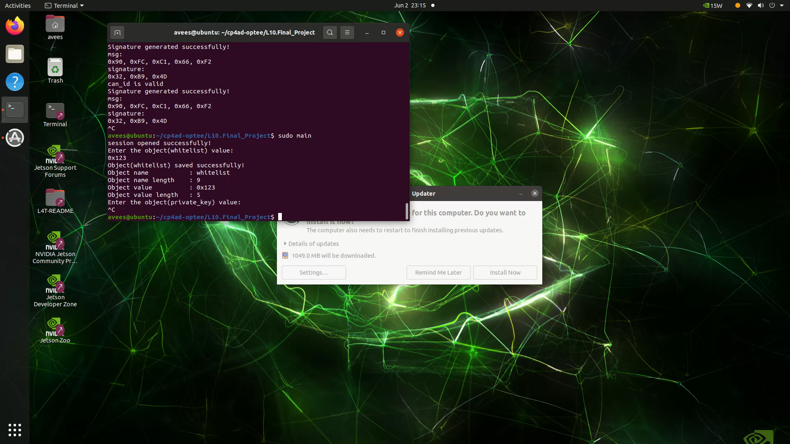
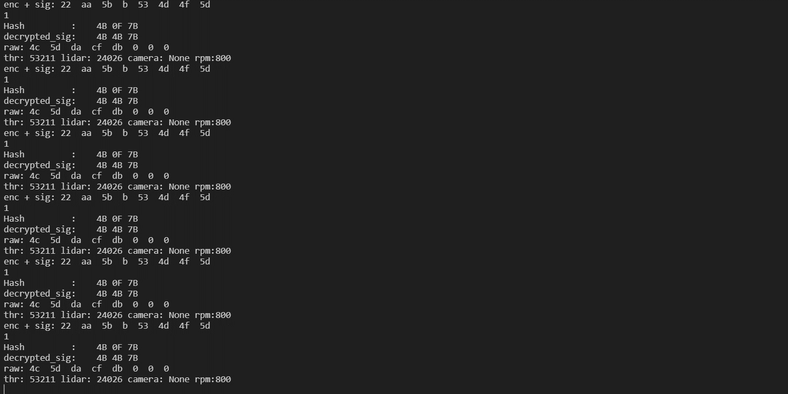
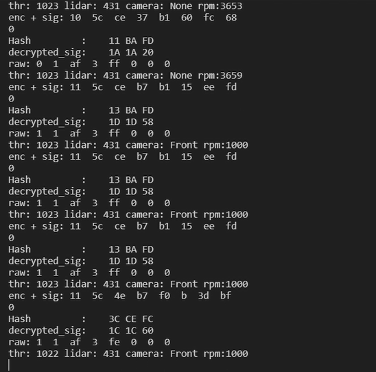

# 🚗 보안 CAN 차량 네트워크 기반 자율주행 시스템

> **ATmega328P + ERIKA Enterprise RTOS** 기반의 보안 통신 임베디드 프로젝트
> 센서 ECU가 수집한 주행 데이터를 **암호화·서명**하여 CAN으로 전송하고, 제어 ECU가 이를 **검증·복호화**한 뒤 차량 모델로 엔진 RPM을 산출합니다.

---

## 📖 개요

자율주행 시나리오를 가정한 차량 내부 네트워크(IVN) 보안 데모입니다. 두 대의 Arduino UNO(ATmega328P)를 OSEK/VDX 호환 실시간 운영체제인 **ERIKA Enterprise(ERIKA3)** 위에서 구동하고, 그 사이에 **OP-TEE(ARM TrustZone 기반 신뢰실행환경)** 가 탑재된 **NVIDIA Jetson Orin Nano** 를 **보안 게이트웨이**로 두는 **3-노드 구조**입니다. 노드 간 통신은 **MCP2517FD 컨트롤러**(ACAN2517FD 라이브러리)를 이용한 **클래식 CAN(CAN 2.0) 프레임**으로 수행합니다.

핵심은 차량 ECU 간 메시지를 평문으로 주고받지 않고, 경량 **대칭키 암호(simple-DES)** 로 도청을 막고, 게이트웨이가 **CAN ID 화이트리스트 검증**과 **공개키 서명(micro-RSA) 부착**을 수행하여 위·변조와 비인가 송신원을 차단하는 것입니다.

> 📌 본 저장소에는 양 끝단 **Arduino ECU(Node1·Node2)** 코드만 포함됩니다. 중간 게이트웨이인 **Orin Nano의 OP-TEE Trusted Application** 코드는 본 저장소 범위 밖이며, 관련 설명은 `docs/` 의 OP-TEE 가이드라인 자료를 참고하세요.

## 🏗️ 시스템 아키텍처



<sub>\* Orin Nano OP-TEE Trusted Application 코드는 본 저장소 범위 밖(별도 관리)</sub>

| 구분 | **① Node1 — 센서 ECU** | **② Orin Nano — 게이트웨이** | **③ Node2 — 제어 ECU** |
|------|----------------------|---------------------------|----------------------|
| 플랫폼 | Arduino UNO + ERIKA | Jetson Orin Nano + OP-TEE | Arduino UNO + ERIKA |
| 역할 | 센서 수집 → 암호화 → 송신 | 화이트리스트 검증 → 서명 부착 → ID 변환 | 검증 → 복호화 → RPM 제어 |
| 입력 | 스로틀(A1), 라이다(A2), 버튼(A0) | CAN `0x123` | CAN `0x456` |
| 보안 | `encrypt()` 40-bit simple-DES | `set_whitelist` · `set_priv_key(0x1234)` · 서명 생성 | `decrypt()` + `micro_verify()` |
| 주요 태스크 | `Task1`, `TASK_readADC`, `Task2`, `ButtonISR` | (OP-TEE TA, 저장소 외부) | `ReadCAN`, `SensorTask` |
| 부가 | 버튼으로 카메라 방향 선택 | `generate_public_key()` | `Car_Model` RPM 모델, 힙 측정 유틸 |

## 🔐 보안 메커니즘

| 구성요소 | 구현 위치 | 설명 |
|----------|----------|------|
| **대칭키 암호화** | Node1 `encrypt()` | 40-bit(5-byte) 블록 `simple_des`, 2-라운드 Feistel, 키 `0x1234` |
| **라운드 함수** | `feistel()` | XOR + 비트 회전 기반 경량 혼합 함수 |
| **CAN ID 화이트리스트** | Orin Nano(OP-TEE) | `set_whitelist(0x123)` 로 인가된 송신원만 통과 |
| **서명 생성** | Orin Nano(OP-TEE) | 신뢰실행환경 내에서 개인키로 3-byte 서명 생성 후 ID `0x456` 으로 전달 |
| **공개키 서명검증** | Node2 `micro_verify()` | 24-bit 미니 RSA(공개지수 `e=17`)로 서명 복원·대조 |
| **해시** | Node2 `mini_hash24()` | 메시지 무결성용 24-bit 커스텀 해시 |
| **대칭키 복호화** | Node2 `decrypt()` | 동일 키 `0x1234` 로 원본 센서값 복원 |

> ⚠️ 본 암호 구현은 **8-bit MCU 학습/데모용 경량 알고리즘**이며 실제 차량에 적용 가능한 안전성을 보장하지 않습니다.

## 📡 CAN 프레임 포맷 (8 byte)



페이로드 5바이트(센서 데이터)는 두 구간 모두 동일하게 암호화되어 있고, 게이트웨이를 거치며 뒤 3바이트에 서명이 채워집니다.

| 바이트 | 필드 | ① Node1 → Orin (`0x123`) | ② Orin → Node2 (`0x456`) |
|--------|------|--------------------------|--------------------------|
| `[0]`   | camera | 카메라 방향 (암호화됨) | 〃 |
| `[1:2]` | throttle | 스로틀 ADC 16-bit (암호화됨) | 〃 |
| `[3:4]` | lidar | 라이다 ADC 16-bit (암호화됨) | 〃 |
| `[5:7]` | signature | `0x00 00 00` (서명자리 비움) | **OP-TEE가 생성한 3-byte 서명** |

> 원본 평문 레이아웃: `[0]`=camera(0:None/Down, 1:Front/Up, 2:Left, 3:Right), `[1:2]`=throttle, `[3:4]`=lidar (16-bit big-endian)

**바이트 분할 (byte-split)**

송신측은 16-bit ADC 값을 상·하위 두 바이트로 쪼개 프레임에 싣고, 수신측은 복호화 후 두 바이트를 다시 16-bit로 합칩니다.

```c
// 송신 — Node1/asw.c
buf_send[0] =  camera_adc        & 0xff;   // [0] 카메라 방향
buf_send[1] = (throttle_adc >> 8) & 0xff;  // [1] throttle 상위 바이트
buf_send[2] =  throttle_adc       & 0xff;  // [2] throttle 하위 바이트
buf_send[3] = (lidar_adc >> 8) & 0xff;     // [3] lidar 상위 바이트
buf_send[4] =  lidar_adc       & 0xff;     // [4] lidar 하위 바이트
buf_send[5] = buf_send[6] = buf_send[7] = 0; // [5:7] 서명자리(0으로 초기화)

// 수신 — Node2/asw.c (복호화 후 재조립)
camera   =  decrypted[0];
lidar    = (decrypted[1] << 8) | decrypted[2];
throttle = (decrypted[3] << 8) | decrypted[4];
```

> ⚠️ **주의:** 송신(Node1)은 `[1:2]=throttle / [3:4]=lidar` 순서로 싣지만, 위 수신(Node2) 복원 코드는 `[1:2]=lidar / [3:4]=throttle` 로 읽어 **두 필드의 순서가 어긋나** 있습니다. 중간 게이트웨이(OP-TEE) 단에서 매핑을 맞추거나, 한쪽 코드의 정정이 필요한 부분입니다.

**처리 흐름**
1. **Node1**: 센서값을 프레임에 적재 → 앞 5바이트(`[0:5]`)를 DES 암호화, 서명자리(`[5:7]`)는 `0` → `10ms` 주기 알람으로 CAN `0x123` 송신
2. **Orin Nano(OP-TEE)**: `0x123` 화이트리스트 확인 → 개인키로 3-byte 서명 생성 → ID를 `0x456`으로 바꿔 `[0:5]`=암호문, `[5:8]`=서명으로 재전송
3. **Node2**: `0x456` 수신 → `micro_verify()` 서명검증 → DES 복호화 → 카메라 방향에 따라 `SensorTask` 이벤트 트리거 → 라이다 거리(`<500`)와 결합하여 회피/기본 모드로 `control_rpm()` 호출

## 🎬 동작 결과 (Demo)

데이터가 **Node1 → OP-TEE 게이트웨이 → Node2** 로 흐르며 암호화·서명·검증되는 전 과정을 실제 시리얼/터미널 캡처로 정리했습니다.

### 1️⃣ Node1 — 센서 수집 & 암호화 송신


`raw`(원본 센서값: throttle·lidar·camera)를 DES로 암호화한 결과가 `enc` 입니다. 이 5바이트와 빈 서명자리(`0 0 0`)를 CAN `0x123` 으로 송신합니다.

### 2️⃣ Orin Nano(OP-TEE) — 화이트리스트 검증 & 서명 생성


ARM TrustZone 보안 영역(OP-TEE TA)에서 `whitelist = 0x123` 와 `private_key` 를 저장하고, 메시지에 대한 3바이트 서명을 만들어 **`signature generated successfully!`** 를 출력합니다. 이후 CAN ID를 `0x456` 으로 변환하여 Node2로 전달합니다.

### 3️⃣ Node2 — 서명 검증 & 복호화


수신한 `enc + sig` 에 대해 `micro_verify` 결과가 **`1`(성공)** 이고 `Hash` 와 `decrypted_sig` 가 일치합니다. 검증을 통과하면 복호화하여 원본 `raw` 센서값을 복원합니다.

### 4️⃣ Node2 — 차량 모델 RPM 제어


복원한 센서값으로 `control_rpm()` 을 호출합니다. 카메라가 물체를 감지(`Front`/`Left`/`Right`)하고 라이다 거리가 임계값(500) 이하이면 **회피 모드**로 RPM을 낮추고(`rpm:1000`), 미감지(`None`)면 **정상 주행**(`rpm:3659`)으로 동작합니다.

> 🎥 위 캡처는 발표 시연 영상의 핵심 장면입니다. (전체 동작 영상은 대용량 관계로 저장소에 포함하지 않았습니다.)

## 📂 디렉토리 구조

```
.
├── Node1/                  # 센서/송신 ECU
│   ├── asw.c               # 애플리케이션 SW (태스크/ISR: ADC 수집·암호화·송신)
│   ├── bsw.cpp / bsw.h     # 기반 SW (CAN 드라이버 래퍼, DES 암호, 시리얼)
│   ├── SPI.cpp / SPI.h     # SPI 드라이버
│   ├── 1.html              # 자율주행 UI 프로토타입(웹)
│   ├── conf.oil            # ERIKA OS 구성 (태스크/알람/ISR 정의)
│   ├── Makefile            # 코드생성·빌드·업로드
│   └── lib/ACAN2517FD/     # MCP2517FD CAN-FD 컨트롤러 라이브러리
│
├── Node2/                  # 제어/수신 ECU
│   ├── asw.c               # 애플리케이션 SW (수신·검증·복호화·RPM 제어)
│   ├── bsw.cpp / bsw.h     # 기반 SW (DES 복호화, RSA 서명검증, 해시, 메모리 유틸)
│   ├── Car_Model.cpp / .h  # 차량 물리 모델 (기어비 기반 RPM 계산)
│   ├── SPI.cpp / SPI.h
│   ├── conf.oil
│   ├── makefile
│   └── lib/ACAN2517FD/
│
├── assets/images/          # README용 동작 결과 캡처
└── docs/                   # 발표 PDF·평가항목·OP-TEE 가이드라인
```

> `erika/`, `out/` 디렉토리는 `make config`·`make build` 시 자동 생성되는 산출물이므로 `.gitignore` 처리되어 있습니다.

## 🔧 하드웨어 구성

| 항목 | 사양 |
|------|------|
| ECU (Node1·Node2) | ATmega328P (Arduino UNO) |
| 보안 게이트웨이 | NVIDIA Jetson Orin Nano + OP-TEE (ARM TrustZone) |
| RTOS (ECU) | ERIKA Enterprise (ERIKA3), OSEK ECC2 |
| CAN 컨트롤러 | MCP2517FD (CAN-FD 지원 칩), SPI 연결 — CS: D9, INT: D2 |
| CAN 통신 | **클래식 CAN 2.0 프레임**(`CAN_DATA`, 8-byte), 500 kbps, 비트레이트 스위치 미사용 |
| 시리얼 | 115200 bps |

## ⚙️ 빌드 & 업로드

> Windows + Cygwin + Eclipse(ERIKA generator) + Arduino AVR 툴체인 환경 기준

**사전 준비**
- ERIKA Enterprise 설치 경로: `C:\eclipse` (`generate_code.bat` 포함)
- Arduino IDE 1.8.16 (AVR 코어): `C:\Arduino`
- 업로드 포트: Node1 = `COM3`, Node2 = `COM6` *(환경에 맞게 `makefile` 수정)*

**빌드 절차** (각 노드 디렉토리에서 실행)

```bash
make config     # conf.oil → erika/ · out/ 코드 자동 생성
make build      # AVR 크로스 컴파일 (→ out/arduino.hex)
make upload     # avrdude 로 보드에 플래시
```

## 📝 설계 참고

- **CAN ID가 `0x123`(Node1 송신) → `0x456`(Node2 수신)으로 바뀌는 것은 의도된 설계**입니다. 중간 게이트웨이인 **Orin Nano(OP-TEE)** 가 화이트리스트 검증 후 ID를 변환하고 서명을 부착합니다. 따라서 Node1이 서명자리(`[5:7]`)를 비워 보내고 Node2가 서명을 검증하는 비대칭 구조는 정상입니다.
- **서명 "생성" 코드가 본 저장소에 없는 이유**도 같습니다 — 서명은 신뢰실행환경인 OP-TEE TA 안에서 만들어지며, 해당 TA 코드는 별도 관리됩니다(`docs/` OP-TEE 가이드라인 참고).
- ATmega328P는 SRAM이 2KB로 매우 제한적이어서 Node2의 `searchRemainMemory()`/`freeMemory()`로 힙 여유를 점검합니다.
- 경량 암호·서명은 8-bit MCU 학습 목적의 데모 구현입니다.

## 👥 팀

| 이름 | 담당 |
|------|------|
| **조정빈** | Node1 — 센서 ECU |
| **김경재** | Node2 — 제어 ECU |

---
*본 저장소는 학습/연구 목적의 임베디드 차량 보안 프로토타입입니다.*
